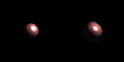
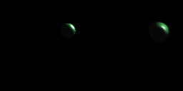
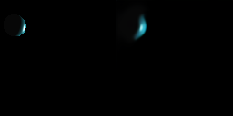
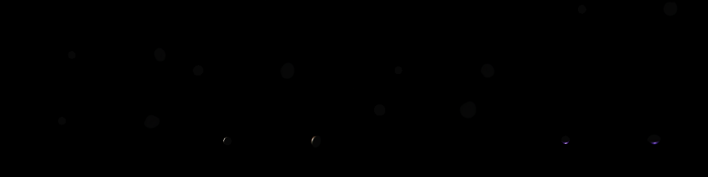
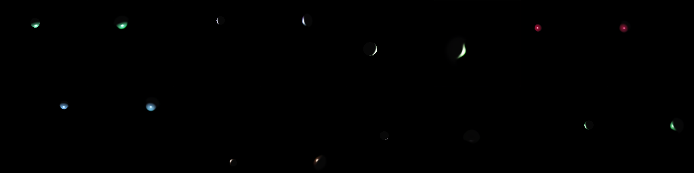
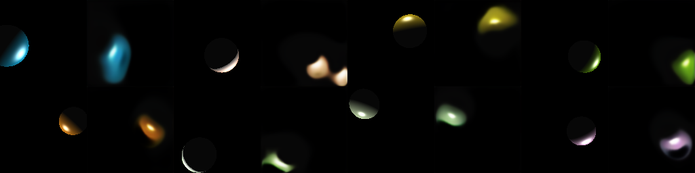

# Rendering neuronowy Phonga

## 1. Cel

Wytrenować sieć generatywną, która dla zadanych parametrów sceny
`(object_pos, light_pos, kd, shininess)` produkuje obraz 128×128 odtwarzający
model oświetlenia Phonga. Scena: jedna kula, jedno punktowe światło, stała
kamera. Ewaluacja względem renderu referencyjnego (GLSL) za pomocą FLIP, LPIPS,
SSIM i odległości Hausdorffa na mapach krawędzi Canny'ego.

## 2. Rozwiązanie

Architektura oparta o conditional GAN typu Pix2Pix.

- Enkoder parametrów - wektor 11-wymiarowy: `obj_pos / 20`,
  `(light − obj) / 40`, `log(1 + ‖light − obj‖) / log 70`, `kd / 255`,
  `(n − 3) / 17`. Reprezentacja relatywna ułatwia modelowi uchwycenie
  geometrii oświetlenia.
- Fourier features (L=6) plus MLP produkuje 128-wymiarowy wektor warunku.
- Generator (5.3M parametrów) - MLP projektuje warunek w mapę 4×4,
  następnie 5 bloków _upsample + conv + GroupNorm + FiLM + SiLU_ doprowadza
  do obrazu 128×128×3. Każdy blok otrzymuje dodatkowo znormalizowane
  współrzędne (y, x) jako extra kanały (CoordConv) - bez tego generator z
  warunkowania skalarnego nie potrafi trafić w pozycję obiektu.
- Discriminator (2.8M parametrów) - PatchGAN 70×70 z warunkiem broadcastowanym
  jako dodatkowe kanały.
- Funkcja straty generatora - suma:
  `100 × L1_fg/bg-ważony + adversarial + 10 × LPIPS(alex)`.
  Strata L1 jest liczona jako osobna średnia dla pikseli tła i obiektu,
  z wagą 10× na obiekt (inaczej dominuje ~99.6% czarnego tła i model kolapsuje
  do "wszystko czarne").
- Funkcja straty D - non-saturating BCE + R1 (γ=0.1, co 16 kroków).

## 3. Dane

Dataset wygenerowany lokalnie rendererem GLSL w ModernGL:

- 15 000 obrazów 128×128, split 70/10/20 (10 500 / 1 500 / 3 000).
- Rejection sampling odrzuca konfiguracje patologiczne (obiekt za kamerą,
  poza frustum, światło wewnątrz kuli, kolor prawie czarny).
- Nominalne zakresy zgodne ze specyfikacją: `obj_pos, light_pos ∈ ⟨−20, 20⟩³`,
  `kd ∈ [0, 255]³`, `n ∈ [3, 20]`.

## 4. Trening

- Sprzęt: NVIDIA DGX Spark (GB10 Blackwell, sm_121, 128 GB unified memory),
  Linux ARM64.
- Konfiguracja: 120 epok, batch 128, Adam(2e-4, β=0.5, 0.999), EMA=0.995,
  BF16 autocast, `torch.compile(mode='reduce-overhead')`.
- Czas: ~80 min (≈40 s na epokę).

## 5. Wyniki

### Tabela metryk (split testowy, 3 000 obrazów)

Dla FLIP, LPIPS oraz Hausdorffa niższe wartości oznaczają lepszą jakość;
dla SSIM - wyższe.

| Metryka               | Średnia | Odch. std | Mediana |
| --------------------- | ------: | --------: | ------: |
| FLIP                  |  0.0075 |    0.0073 |  0.0058 |
| LPIPS                 |  0.0483 |    0.0355 |  0.0395 |
| SSIM                  |  0.9747 |    0.0250 |  0.9819 |
| Hausdorff (Canny, px) |   10.77 |     34.38 |    3.61 |

Wszystkie trzy percepcyjne/strukturalne metryki są bliskie optymalnym wartościom
dla tej klasy zadań. Mediana Hausdorffa (3.6 px na obrazie 128×128) pokazuje, że
_typowy_ kształt obiektu jest odtwarzany niemal pixel-perfect; wysoka średnia
i odchylenie wynikają z ~5% przykładów, które znacząco odstają (patrz sekcja 6).

### Scenariusze referencyjne (GT | wygenerowane)



Easy - kula w centrum, n=5, kolor czerwony. Model odtwarza kształt,
highlight i cieniowanie z pomijalną różnicą.



Medium - offcenter, n=10, diffuse zielony. Pozycja, rozmiar i gradient
oświetlenia prawidłowe.



Hard - off-axis, n=19, tył oświetlony. Widać lekko rozmazaną krawędź
highlightu, ale ogólny kształt i barwa zachowane.

### Rozkład jakości w zbiorze testowym



Najlepsze (8 najniższych FLIP) - głównie bardzo małe, ciemne obiekty
daleko od kamery. Na tego typu konfiguracjach niemal każdy piksel jest czarny
i reprodukcja jest trywialna.



Losowe (seed=0) - typowa jakość. Model zachowuje kolor, pozycję,
wielkość i highlight.



Najgorsze (8 najwyższych FLIP) - duże, jasne obiekty blisko kamery. Tam
każdy drobny błąd w pozycji highlightu, krawędzi lub nasyceniu koloru daje
wymierny spadek metryki. Model generuje zbyt miękkie krawędzie i rozlewa
highlight poza sylwetkę.

## 6. Dyskusja - która metryka najlepiej oddaje jakość?

| Metryka         | Co wychwytuje                                                                                    | Słabość                                                                                  |
| --------------- | ------------------------------------------------------------------------------------------------ | ---------------------------------------------------------------------------------------- |
| FLIP            | Różnica percepcyjna (CSF + CIELab + krawędzie/punkty); zaprojektowana przez NVIDIA pod rendering | Saturuje na obrazach z przewagą czerni - tło wypełnia większość kadru                    |
| LPIPS           | Dystans cech AlexNet na mid-level features                                                       | Kalibrowany na naturalnych obrazach; liberalny dla syntetycznych renderów                |
| SSIM            | Luminancja × kontrast × struktura w oknie                                                        | Dominowany przez tło; na obrazach z dużą przewagą czerni wartości są sztucznie wysokie |
| Hausdorff-Canny | Czysto geometryczne: dystans między sylwetkami na mapie krawędzi                                 | Wrażliwy na outliery - pojedyncza rozjechana krawędź podbija wynik                       |

Wnioski praktyczne:

1. FLIP jest najbardziej skondensowaną liczbą do raportowania - reaguje
   na wszystko: pozycję, barwę, kształt, highlight.
2. SSIM i LPIPS zgadzają się co do ogólnej jakości (oba wysokie/niskie
   idą w parze), ale SSIM zawyża wynik przez dominujące tło.
3. Hausdorff-Canny ujawnia przypadki, w których pozostałe metryki są na pozór
   dobre - widać to po różnicy _mediana 3.6 px_ vs _średnia 10.8 px_:
   95% obrazów ma krawędź "prawie pixel-perfect", ale 5% ma rozjechane
   sylwetki, które psują średnią. Ta metryka jest najczulsza na właśnie ten typ
   błędu, którego "pikselowe" metryki nie wyłapią.
4. Żadna pojedyncza metryka nie wystarczy - FLIP + Hausdorff to minimalny
   zestaw dla tego zadania; SSIM jako sanity check, LPIPS jako perspektywa
   percepcyjna.

## 7. Co nie zadziałało i dlaczego

Droga do obecnego rozwiązania prowadziła przez kilka ślepych uliczek.
Każda z nich pokazała coś istotnego o naturze zadania i dlatego warto je
opisać.

### 7.1. Mode collapse na zwykłym L1

Pierwsza wersja treningu używała klasycznej straty L1 uśrednionej po
wszystkich pikselach obrazu. Po kilku epokach generator kolapsował do
trywialnego rozwiązania: malował wyłącznie czarny obraz niezależnie od
wejścia. Powód stał się oczywisty po analizie statystyk datasetu: kula
zajmuje zazwyczaj tylko ~0.4% powierzchni kadru, więc 99.6% pikseli jest
czarna. Jeśli model nauczy się "wszystko czarne", jego L1 wynosi ≈ 0.004 -
numerycznie bardzo niska wartość, którą discriminator dodatkowo uznaje za
"realistyczny" obraz (w danych treningowych większość pikseli też jest
czarna). Sygnał gradientowy płynący z L1 na samą kulę był po prostu zbyt
słaby, żeby zmotywować generator do malowania czegokolwiek.

### 7.2. Pozornie dobra poprawka - mask-weighted L1 z addytywną wagą

Pierwsza próba naprawy wyglądała tak: `l1 = ((fake - real).abs() * (1 + w * mask)).mean()`,
gdzie `mask` oznacza piksele obiektu a `w = 10`. Intuicja: piksele kuli
mają liczyć się 11× więcej niż tło. Rzeczywistość: ponieważ `mask` to
binarna maska pokrywająca 0.4% kadru, średnia waga w obrazie wynosi
`1 + 10 × 0.004 ≈ 1.04`. Chociaż pojedynczy piksel kuli ma 11-krotnie
wyższą wagę niż tła, to po uśrednieniu przez wszystkie 49 152 piksele
sumaryczny wkład pikseli obiektu do straty jest nadal marginalny (mniej
niż 5% łącznej wartości). Model dalej kolapsował, tylko wolniej. Ten
błąd pokazał, że przy tak silnej nierównowadze klas addytywna waga w
jednej globalnej średniej nie ma sensu.

### 7.3. Właściwa poprawka - osobne średnie per region

Poprawne przeważenie wymaga obliczenia dwóch _niezależnych_ średnich L1:
jednej dla pikseli tła i drugiej dla pikseli obiektu. Dopiero ich
ważona suma `L1 = bg_l1 + w × fg_l1` daje `w`-krotny sumaryczny wkład
błędu na kuli do całej straty. Po rozpisaniu na gradient per piksel:
piksel kuli otrzymuje gradient proporcjonalny do `w / liczba_pikseli_kuli`,
piksel tła do `1 / liczba_pikseli_tła`. Ponieważ piksele tła są ~250×
liczniejsze niż piksele kuli, efektywny gradient na jednym pikselu obiektu
jest w tej formule ~230× silniejszy niż w poprzedniej, gdzie waga 11
dzielona była przez liczbę wszystkich pikseli. Model zaczął malować kulę
od pierwszej epoki.

### 7.4. Rozmyte plamy zamiast kul - brak CoordConv

Z poprawionym L1 generator uczył się prawidłowych _kolorów_ i przybliżonej
_pozycji_ kuli, ale produkował kolorowe rozmyte plamy zamiast ostrych
sylwetek. Analiza architektury wyjaśniła dlaczego: warstwy FiLM modulują
kanały globalnie (te same γ, β stosowane do każdego piksela), więc nie
niosą informacji "jestem konkretnie na pikselu (x, y)". Pozycja
przestrzenna musiała być zrekonstruowana przez generator z
4×4-pikselowej początkowej mapy cech MLP - wąskie gardło
reprezentacyjne.
Dodanie do każdego upsample blocka dwóch kanałów ze znormalizowanymi
współrzędnymi `(y, x) ∈ [-1, 1]` (technika CoordConv) dało modelowi
explicite spatial awareness i kule od razu stały się sferyczne.

### 7.5. Prawdziwy bottleneck - za mało danych

Po wszystkich powyższych poprawkach metryki utknęły na plateau: LPIPS ≈ 0.19,
Hausdorff ≈ 100 px. Dziwna obserwacja: LPIPS _na trainie_ wynosił 0.046,
ale _na teście_ 0.19. Różnica 4× przy jednocześnie niskim val L1
sugerowała, że nie jest to klasyczny overfitting na wagach, tylko
niewystarczające pokrycie przestrzeni konfiguracji przez dataset
(3 000 próbek). Każda
scenka jest opisana 10 liczbami (pozycja obiektu 3, pozycja światła 3,
kolor 3, połyskliwość 1), co daje
gigantyczną przestrzeń wariantów; 3k punktów to zbyt rzadkie próbkowanie.
Regeneracja datasetu z `n=15000` i retrening z tymi samymi hiperparametrami
dała jednorazowy skok: LPIPS spadł do 0.048, Hausdorff do 3.6 px mediany.
Zadanie okazało się _data-bound_, nie _architecture-bound_.

## 8. Ograniczenia

- Brak pretreningu geometrii - model musi jednocześnie nauczyć się
  projekcji z 3D na 2D i oświetlenia Phonga z samego wektora skalarnego.
  Prace z literatury (Deep Shading, RenderNet) używają G-bufferów lub
  voxelowych reprezentacji. W tej pracy trzymamy się "czystego" wariantu
  zgodnego z duchem specyfikacji.
- Ogon Hausdorffa - ~5% przypadków ma wyraźnie gorsze odwzorowanie
  krawędzi. Są to głównie duże, bardzo jasne kule blisko kamery z wysokim `n`.
- Uniform OpenGL nie gwarantuje bit-identyczności między GPU -
  reprodukcja na innej maszynie daje praktycznie identyczne, ale nie
  bit-perfect obrazy (reguły ARB invariance).

## 9. Reprodukcja

```bash
# setup
uv sync

# dane + trening + ewaluacja + raport
uv run gleam generate-data --n 15000
./scripts/train_dgx.sh --epochs 120        # lub: uv run gleam train --epochs 120
uv run gleam eval   --ckpt outputs/checkpoints/ema_generator.pt
uv run gleam report --ckpt outputs/checkpoints/ema_generator.pt
```
